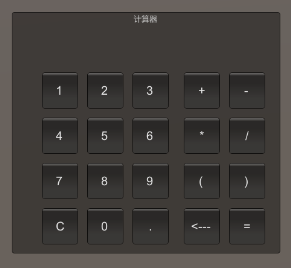

# Unity_GUI_Calculate
**演示视频：**[GUI计算器视频演示](https://www.bilibili.com/video/BV1u44FezEHq/?vd_source=33bf8d83177f61b586cffade1472056c)<br>

3D游戏编程的第二次作业，使用unity的GUI实现一个简单的计算器,最终成果是一个可以使用的script<br>

使用方法是将该script导入场景中的摄像头中（随意一个物件），点击开始就能看到屏幕上出现一个方框<br>

* 可以点击数字键输入数字
* 点击符号键输入+-*/，以及可以表示小数的小数点和括号
* 如果有输入错误可以用退格键删除最末尾的字符
* 如果点击左下角的C可以全部清除
* 点击=进行计算，如果算式的格式错误=将不会输出任何结果
## 设计思路
这个Script一共分为三个部分，分别是**实体**，**GUI绘制**，**组件**<br>
* 实体：用于存储所有需要用到的实体的状态和模型
* GUI绘制：仅用于进行对于GUI的绘制，此部分不含有具体的函数实现
* 组件：此部分包含了程序需要实现的主要功能，将具体的功能封装成不同的函数，最后集中在OnGUI的函数中进行调用
## 具体实现
### 实体
```csharp
private GUIStyle labelStyle;//文本框显示文字的大小与位置
private GUIStyle buttonStyle;//按钮上文字的style
private List<char> vec=new List<char>();//储存算式或结果的地方
string equation = string.Empty;//拼接成字符串的式子或结果（用于显示）
```
* lablestyle：用于调整文本框中文字的格式与大小
* buttonStyle：用于调整按钮中的文字格式与大小
* vec：一个存储字符的List类型，用于存储用户的输入行为，每输入一个符号就会在末尾插入，方便最后进行计算
* equation：一个将用户输入的所有字符拼接之后的字符串（算式），用于在文本框中显示
### GUI绘制
```csharp
void OnGUI()
{
    Init();//将默认的配置初始化
    GUI.Box(new Rect(500, 300, 445, 400),"计算器");//范围是x500-945，y300-700
    GUI.Label(new Rect(550, 325, 370, 60), equation, labelStyle);//初始化用于显示计算的文本框，之后更改equation中的内容，就可以更改显示的文本
    mybutton();//进行按钮的相关逻辑
}
```
该函数在画面的每一帧都会调用，Init和mybutton函数都是组件中的功能性函数，不在这个部分做具体实现，该部分主要用来绘制GUI的主要外观<br>
使用**GUI.Box**函数绘制存放所有按钮与文本框的界面（相当于**背景**），拥有两个参数：
* 第一个位置是创建界面的Position，该参数随附一个Rect函数，其中四个参数分别表示（最左侧位置、最顶部位置、总宽度、总高度）
* 第二个位置是Content，表示创建的该Box的标题，可以输入字符串
同理，使用**GUI.Label**来绘制用于显示算式和结果的文本框，拥有三个参数：
* 第一个参数与上面同理，不再赘述
* 第二个参数equation是自己创建的一个字符串变量，用于存储算式和答案，因为OnGUI每一帧都会调用，因此当equation变化的时候文本框中的文字也会变化，不需要每次变化的时候都更新一遍文本框，只需要**更新equation**就行
* 第三个参数便是设置好的文本框格式
### 组件
#### 状态初始化
```csharp
void Init()
{
    equation = string.Join("", vec);//将算式列表中的字符拼接成字符串

    labelStyle = new GUIStyle(GUI.skin.label);// 创建一个文本框的style
    labelStyle.fontSize = 20;// 设置字体大小
    labelStyle.alignment = TextAnchor.MiddleRight;// 设置文本对齐方式为右对齐

    buttonStyle = new GUIStyle(GUI.skin.button);// 创建一个按钮的style
    buttonStyle.fontSize = 20;// 设置字体大小
}
```
该函数是用来初始化的，会在运行一开始被Start函数以及OnGUI中被每帧调用，因此可以用来设置一些关于文本框或者按钮格式<br>
第一行表示对equation的重计算，因为Init在OnGUI函数中会被每一帧都调用一次，因此可以保证**文本框中的信息实时更新**<br>
关于文本框格式的设置可以详见代码中的注释
#### 按钮逻辑
按钮的行为逻辑都放在**mybutton**的函数中，进行按钮的绘制以及功能的实现
##### 数字符号
只举例其中的一个按钮，其余0-9，+，-，*，/等按钮逻辑与以下代码几乎相同（除了有不一样的Content）
```csharp
if (GUI.Button(new Rect(550, 400, 60, 60), "1", buttonStyle))
{
    vec.Add('1');//像算式中添加用户输入的字符
}
```
使用GUI绘制按钮需要用到**if语句**，条件就是按钮的创建语句，参数与文本框相同，分别表示**Position**，**Content**，**Style**<br>
如果条件为**真**，其中的逻辑就代表按下之后会发生事件<br>
对于数字符号的按钮来说，只需要在每次按下的时候向存储算式的字符容器vec中尾部添加就完成任务了，对于文本框中显示的算式更新，会在Init通过实时更新equation实现，因此不需要每次按下按钮之后手动更新
##### 退格
```csharp
if (GUI.Button(new Rect(785, 625, 60, 60), "<---", buttonStyle))
{
    if (vec.Count > 0)//判断长度不为零
    {
        vec.RemoveAt(vec.Count-1);//将vec末尾的字符移除
    }
}
```
退格键的实现相当于是将vec容器中的**最末尾**（**最新加入**）的字符给移除，因此先判断vec的长度是否为0（防止出现内存访问错误），然后使用Removeat函数删除位于**容器长度-1**的字符
##### 清空
```csharp
if (GUI.Button(new Rect(550, 625, 60, 60), "C", buttonStyle))
{
    vec.Clear();//清空算式
}
```
如果用户按下C清零键，就代表着所有信息都要清零，所以分为两个部分实现：**清空文本框**和**清空算式**<br>
其实这两步可以只用**一**步实现，只需要用**Clear**函数将存储算式的vec清空，根据vec来拼接字符串的equation也会被清空，因此文本框也会被清空
##### 计算
```csharp
if (GUI.Button(new Rect(860, 625, 60, 60), "=", buttonStyle))
{
    calculating();//计算算式
}
```
计算是当用户按下**等于**符号（=）的时候才开始的，计算逻辑会单独封装在一个calculating函数中，因此=按钮只需要调用该函数就可以
#### 计算逻辑
```csharp
var dataTable = new System.Data.DataTable();//创建一个用于进行数据处理的datatable类
equation = Convert.ToString(dataTable.Compute(equation, string.Empty));//使用自带的Compute函数对传入表达式进行简单的计算，第二个条件是筛选条件为空
char[] charArray = equation.ToCharArray();//将字符串拆分成单个字符
vec.Clear();//清空算式
foreach (char c in charArray)
{
    vec.Add((char)c);
}
```
计算逻辑被封装在组件之一的**calculating**函数中，主要使用**Datatable**中的**Conpute**内置函数来计算简单的表达式<br>
**Conpute**函数的参数有两个：equation是需要计算的具有**简单表达式格式**的字符串，第二个参数表示**筛选条件**，此处筛选条件为空就填入空字符串<br>
由于计算之后会返回**Object**类型，因此要**转换成string**类型并赋值给equation<br>
但由于equation本质上会在每一帧的OnGUI调用中**由vec中的字符拼接**而成，因此最终需要把equation中的每个字符**按顺序存储在vec**中，这样才能保证结果能够正确显示，于是要先将vec清空，然后将转换成字符数组的equation中的每个字符添加进去（具体实现如上代码）
